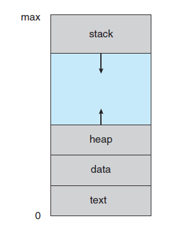

# Sistemas Operativos

Un sistema informático puede dividirse en cuatro componentes:

- el hardware
- el sistema Operativo
- los programas de aplicación
- los usuarios

El Sistema operativo controla y coordina el uso del hardware entre los diversos programas de aplicación por parte de los distintos usuarios.

El S.O. proporciona los medios para hacer un uso adecuado de los recursos del sistema durante su funcionamiento.

## Indice

- [Características del Sistema Operativo](##Características-del-Sistema-operativo)
- [Procesos](##Procesos)
- [Hilos](##Hilos)
- [Planificación de la CPU](##Planificación-de-la-CPU)
- [Memoria Principal](##Memoria-Principal)
- [Memoria Virtual](##Memoria-Virtual)

## Características del Sistema operativo

Un sistema operativo es un programa que actúa como intermediario entre el usuario y el hardware de la computadora. Se podría decir que el kernel es el programa en ejecución en todo momento en la computadora.

### Servicios brindados

Los servicios que brinda un sistema operativo puede variar de uno a otro, pero se pueden determinar determinadas clases comunes:

- Interfaz de usuario (GUI, CLI)
- Ejecución de programas
- Operaciones de E/S
- Manipulación del sistema de archivos
- Comunicaciones
- Detección de errores
- Asignación de recursos
- Auditoría
- Protección y seguridad

#### Interfaz de usuario

Existen dos métodos fundamentales para interactuar con el sistema operativo.

##### Intérprete de comandos *CLI command-line interface*

Incluido en el kernel o cómo un programa especial.
Permite a los usuarios dar instrucciones a los programas e interactuar con el sistema operativo desde una línea de texto simple.

En sistemas que disponen de varios intérpretes estos son conocidos como shells.

Ejemplos son:

- En Windows: cmd, Power Shell
- En Linux: Bourne shell, C shell, Bourne Again shell, Korn shell, etc.

##### Interfaz gráfica de usuario *GUI graphical user interface*

Interfaz amigable para la interacción con el sistema operativo y los programas de usuario donde se utilizan imágenes, iconos y objetos gráficos en general para representar la información y acciones disponibles.

Suele estar caracterizada por la metáfora del escritorio, y se combina con el uso del ratón, teclado y monitor.

#### Ejecución de programas

El SO deberá ser capaz de cargar un programa a memoria y ejecutarlo. El programa deberá poder finalizar, de forma normal o anormal.

#### Operaciones de E/S

Deberá proveer un mecanismo de acceso ya que por eficiencia y protección los usuarios no accederán directamente al dispositivo. De este modo se brinda un acceso común a los distintos dispositivos brindando servicios tales como:

- Montaje y desmontaje de dispositivos
- Una interfaz entre el cliente y el sistema operativo para los device drivers.
- Técnicas de cache, buffering y spooling.
- Device drivers específicos

#### Manipulación del sistema de archivos

Es necesario tener acceso al sistema de archivos y poder, como mínimo, leer, escribir, borrar y crear.

Proporciona una vista uniforme de todas las formas de almacenamiento, implementando el concepto de archivo como una colección de bytes. provee métodos para:

- Abrir, cerrar y crear archivos
- Leer y escribir archivos

#### Comunicaciones

Los procesos deben poder comunicarse, ya sea que estén en el mismo computador o el diferentes, por lo que el S.O. debe brindarles mecanismos para poder llevar a cabo esta tarea.

#### Detección de errores

El sistema deberá tomar decisiones adecuadas ante eventuales errores que ocurran, como fallo de un dispositivo de memoria, fallo en un programa, etc.

#### Asignación de recursos

Debe administrar los distintos recursos disponibles en el equipo (CPU, RAM, dispositivos de entrada y salida), entre los procesos que intentan hacer uso de ellos para que se saque el mayor provecho de lo disponible.

#### Auditoría

En los sistemas multi usuario es fundamental mantener un control sobre quién realiza cambios en el sistema y en que momento.

#### Protección y seguridad

Se establecen mecanismos por los que se controla el acceso de los procesos a los recursos.

En un sistema multi usuario donde se ejecutan procesos de forma concurrente se deben tomar medidas que garanticen la ausencia de interferencia entre ellos. Estas medidas deben incorporar la posibilidad de definir reglas de acceso, entre otras cosas.

### Llamadas al sistema

Proporcionan una interfaz con la que poder invocar los servicios que el sistema operativo ofrece. Generalmente escritas en C y C++, y en determinadas tareas de bajo nivel en lenguaje ensamblador.

Pueden ser agrupadas de forma muy general en cinco categorías:

- Control de procesos
- manipulación de archivos
- manipulación de información de mantenimiento
- comunicaciones y protección

#### API

Normalmente los desarrolladores de aplicaciones utilizan una API (application programing interface). Estas interfaces son más sencillas de utilizar, robustas y muchas veces se cuentan con interfaces portables que pueden ser utilizadas en varios sistemas operativos, como por ejemplo POSIX.

- Win32 API
- POSIX API
- Java API

#### Interrupciones

Cuando una aplicación o un dispositivo solicita la intervención o un servicio del sistema operativo se realiza una interrupción.

La interrupción pasa el control a la rutina de manejo de interrupciones a través del vector de interrupción, que contiene las direcciones de todas las rutinas de servicio.
La arquitectura de interrupción debe salvar la dirección de la instrucción interrumpida Las interrupciones que entran son deshabilitadas mientras otra interrupción está siendo procesada.

Una trampa (trap) es una interrupción de software ocasionada por un error.

El sistema operativo es dirigido por interrupciones.

### Estructura del sistema

La estructura interna de los sistemas operativos pueden ser muy diferentes, ya que se debe tener en cuenta las metas de los usuarios (fácil uso, confiable, rápido, etc.) y las del sistema (fácil de diseñar, implementar y mantener, eficiente, etc.).  
Veremos 3 posibles diseños del sistema.

- Sistema monolítico
- Sistema en capas
- Sistema con micro núcleo

Es importante tener en cuenta que ningún sistema es puramente de un tipo.

#### Sistema monolítico

Estos sistemas no tienen una estructura definida, sino que son escritos como una colección de procedimientos donde cualquier procedimiento puede invocar a otro. Escrito para proveer la mayor funcionalidad en el menor espacio.

Ejemplos de estos sistemas pueden ser MS-DOS o Linux (aunque incluye algo de capas).

#### Sistema en capas

El diseño se organiza en una jerarquía de capas, donde los servicios que brinda una capa son consumidos solamente por la capa superior. La capa 0 es del Hardware y la N es la de los procesos de Usuario.

Estos sistemas tienen como ventaja que son modulares y la verificación se puede hacer a cada capa por separado (son más mantenibles). Sin embargo el diseño es muy costoso y es menos eficiente que el sistema monolítico ya que los niveles agregan una carga adicional a las llamadas al sistema.

#### Sistema con micro núcleo

La idea consiste en tener un núcleo que brinde los servicios mínimos de manejo de procesos, memoria y que provea la comunicación entre procesos. Todos los restantes servicios se construyen como procesos separados del micro núcleo, que ejecutan en modo usuario.

Estos sistemas tienen como ventaja un diseño simple y funcional, que aumenta la portabilidad y la escalabilidad. Para agregar un nuevo servicio no es necesario modificar el núcleo, y es más seguro ya que los servicios corren en modo usuario. La desventaja con respecto a los sistemas monolíticos es en cuanto a la sobrecarga de comunicación entre espacios de usuario y kernel.

#### Módulos

Algunas partes del núcleo pueden encontrarse en forma de archivos independientes llamados módulos que pueden ser cargados en tiempo de ejecución.

Puede ser util cargar determinados módulos en caso de que un dispositivo se encuentre disponible, al momento de que sea solicitado, o por algún tipo de política de planificación o seguridad requerida.

La mayoría de los S.O. modernos implementan módulos de kernel.

- Enfoque orientado a objetos
- Cada componente base está separado
- Cada uno habla con los otros a través de interfaces comunes.
- Cada uno puede cargarse conforme se necesita

Similar a las capas pero más flexible.

 Entre sus ventajas se encuentra el hecho de que el kernel no debe cargar todo desde un principio, pudiéndose expandir de ser requerido, el núcleo no es tan grande y no es necesario recompilar para agregar nuevos módulos.

 Tiene algunas desventajas en cuanto a la seguridad ya que un modulo puede comprometer el sistema ya que correrá en modo kernel. En algunos sistemas como Linux los módulos solo se pueden cargar con permisos elevados.

## Procesos

Administración de Procesos Para comenzar debemos saber que es un proceso. Un proceso es un programa en memoria + CPU + acceso a dispositivos + otros recursos. Notemos que un proceso necesita de ciertos recursos (como CPU, memoria, archivos, dispositivos de E/S, etc.) para realizar su tarea.  

En otras palabras un proceso es un programa en ejecución, por lo que se puede notar que es una entidad activa, mientras que un programa una entidad pasiva.  

Sabiendo entonces que es un proceso, podemos decir entonces que el sistema operativo es el encargado de su administración. Es el encargado de proveer servicios para que cada proceso pueda realizar su tarea. Entre los servicios se encuentran:

- Crear y destruir procesos
- Suspender y reanudar procesos
- Proveer mecanismos para la sincronización y comunicación entre procesos
- Proveer mecanismos para prevenir dead-locks o lograr salir de ellos

### PCB

Para el sistema operativo el proceso es representado por el bloque descriptor de proceso *PCB* (Process Control Block), Donde se guarda toda la información relevante del proceso, tal como:

- identificador
- Estado del proceso
- Contador de programa
- Registros de la CPU
- Información de planificación de la CPU
- Información de gestión de memoria
- Información de contabilidad
- Estado de E/S

Entre otros datos.

### Procesos en memoria

Los procesos en memoria contienen varias secciones:

- Text (Código) Instrucciones del proceso.
- Data (Datos) Variables globales del proceso.
- Heap (Memoria dinámica) Memoria dinámica que genera el proceso.
- Stack (Pila) Utilizado para preservar el estado en la invocación anidada de procedimientos y funciones.



### Estado de los procesos

El estado de un proceso es definido por la actividad corriente en que se encuentra. Los estados de un proceso son:

- Nuevo (new): Cuando el proceso es creado.
- Ejecutando (running): El proceso tiene asignado un procesador y está ejecutando sus instrucciones.
- Bloqueado (waiting): El proceso está esperando por un evento (que se complete un pedido de E/S o una señal).
- Listo (ready): El proceso está listo para ejecutar, solo necesita del recurso procesador.
- Finalizado (terminated): El proceso finalizó su ejecución

#### Transiciones entre los estados

##### Nuevo –> Listo

Al crearse un proceso pasa inmediatamente al estado listo.

##### Listo –> Ejecutando

En el estado de listo, el proceso solo espera para que se le asigne un procesador para ejecutar. Al liberarse un procesador el planificador (scheduler) selecciona el próximo proceso, según algún criterio definido, a ejecutar.

##### Ejecutando –> Listo

Ante una interrupción que se genere, el proceso puede perder el recurso procesador y pasar al estado de listo. El planificador será el encargado de seleccionar el próximo proceso a ejecutar.

##### Ejecutando –> Bloqueado

A medida que el proceso ejecuta instrucciones realiza pedidos en distintos componentes (ej.: genera un pedido de E/S). El proceso es puesto en una cola de espera hasta que se complete su pedido. De esta forma, se logra utilizar en forma más eficiente el procesador.

##### Bloqueado –> Listo

Una vez que ocurre el evento que el proceso estaba esperando en la cola de espera, el proceso es puesto nuevamente en la cola de procesos listos.

##### Ejecutando -> Terminado

Cuando el proceso ejecuta su última instrucción pasa al estado terminado. El sistema libera las estructuras que representan al proceso.

### Colas de procesos

Los procesos, según su estado, deberán esperar por determinados eventos. Puede suceder, que más de un proceso esté esperando por el mismo evento, es por eso que se deben organizar en diferentes colas o listas.

#### Lista de procesos del sistema (job queue)

Esta será una lista especial, porque los procesos que están en ella no esperan por nada en particular, sino que es la lista de todos los procesos del sistema. Al crearse un nuevo proceso se agrega el PCB a esta lista. Cuando el proceso termina su ejecución es borrado.

#### Cola de procesos listos (ready queue)

Esta cola se compondrá de los procesos que estén en estado listo. La estructura de esta cola dependerá de la estrategia de planificación utilizada.

#### Cola de espera de dispositivos (device queue)

Los procesos que esperan por un dispositivo de E/S particular son agrupados en una lista específica al dispositivo. Cada dispositivo de E/S tendrá su cola de espera, por lo que existirán varias device queue.

### Creación de procesos

Los procesos de un sistema son creados a partir de otro proceso. Normalmente al creador se le denomina padre y al nuevo proceso hijo, lo cual genera una jerarquía de procesos en el sistema.

Una vez creado el nuevo proceso tendrán un hilo de ejecución propio, y el sistema generará un nuevo PCB para el proceso creado.

En UNIX podemos crear un nuevo proceso a través de la llamada al sistema fork.  
La invocación a esta función le retorna al padre el número de process id del hijo recién creado y al hijo el valor 0. El hijo comienza su ejecución en el retorno del fork.  

```c
int main() {
    pid_t pid;
    pid = fork();
    if (pid < 0){
        /* error */
        fprintf(stderr, "Falló el Fork");
    }
    if (pid == 0) {
        /* proceso hijo */
        fprintf("soy el hijo!");
    }
    else {
        /* proceso padre */
        fprintf("soy el padre!");
    }  
}
```

También se brinda métodos, por ejemplo [exec](http://man7.org/linux/man-pages/man3/exec.3.html), para después de utilizar fork reemplazar el espacio de memoria del proceso con un programa nuevo.

### Cambio de contexto (context switch)

A la tarea de cambiar un proceso por otro en el procesador se le denomina cambio de contexto cambio de contexto. Cuando se realiza un cambio de contexto el sistema debe preservar el estado del viejo proceso y cargar el del nuevo, esta tarea implica:

- Salvar el estado del proceso (registros, información de punteros de memoria) que está ejecutando en su PCB.
- Cambiar el estado del proceso que estaba ejecutando al que corresponda (Listo, bloqueado o terminado).
- Cargar el estado del proceso asignado a la CPU a partir de su PCB.
- Cambiar el estado del proceso nuevo a ejecutando.

El tiempo de cambio de contexto es sobrecarga, no se realiza trabajo útil mientras tanto, y que tanto demore depende del soporte de hardware.

### Comunicación entre procesos

Procesos que se ejecutan concurrentemente pueden ser procesos independientes o cooperativos. Un proceso es cooperativo si puede afectar o verse afectado por los restantes procesos que se ejecuten en el sistema, y es independiente si no. Así, cualquier proceso que comparta datos con otro será cooperativo.

#### cooperación de procesos

##### Compartir información

Dado que varios usuarios pueden estar interesados en la misma información, se debe proveer un acceso concurrente a ella.

##### Acelerar cálculos

Si deseamos que una determinada operación se ejecute rápidamente, debemos dividirla en subtareas ejecutándose cada una de ellas en paralelo. Esto consigue solo si hay múltiples CPU o varios canales de E/S.

## Hilos

La mayoría de los sistemas operativos proporcionan características que permiten que un proceso tenga múltiples hilos de control.

Un hilo es una unidad básica de utilización de CPU, la cual contiene un id de hilo, su propio program counter, un conjunto de registros, y una pila; que se representa a nivel del sistema operativo con una estructura llamada TCB (thread control block).

Los hilos comparten con otros hilos que pertenecen al mismo proceso la sección de código, la sección de datos, entre otras cosas. Si un proceso tiene múltiples hilos, puede realizar más de una tarea a la vez (esto es real cuando se posee más de un CPU).

### Ventajas de usar hilos

#### Respuesta

El tiempo de respuesta mejora, ya que el programa puede continuar ejecutándose, aunque parte de él esté bloqueado.

#### Compartir recursos

Los hilos comparten la memoria y los recursos del proceso al que pertenecen, por lo que se puede tener varios hilos de ejecución dentro del mismo espacio de direcciones.

#### Economía

Es más fácil la creación, cambio de contexto y gestión de hilos que de procesos.

#### Utilización múltiples CPUs

Permite que hilos de un mismo proceso ejecuten en diferentes CPUs a la vez. En un proceso mono-hilo, un proceso ejecuta en una única CPU, independientemente de cuantas tenga disponibles.

### Hilos a nivel de usuario y de kernel

Los hilos pueden ser implementados a nivel de usuario o a nivel de kernel.  

#### Hilos a nivel de usuario

Son implementados en alguna librería. Estos hilos se gestionan sin soporte del SO, el cual solo reconoce un hilo de ejecución.

#### Hilos a nivel de kernel

El SO es quien crea, planifica y gestiona los hilos. Se reconocen tantos hilos como se hayan creado.

Los hilos a nivel de usuario tienen como beneficio que su cambio de contexto es más sencillo que el cambio de contexto entre hilos de kernel. A demás, se pueden implementar aún si el SO no utiliza hilos a nivel de kernel.

Otro de los beneficios consiste en poder planificar diferente a la estrategia del SO. Los hilos a nivel de kernel tienen como gran beneficio poder aprovechar mejor las arquitecturas multi procesadores, y que proporcionan un mejor tiempo de respuesta, ya que si un hilo se bloquea, los otros pueden seguir ejecutando.

#### Relación hilos a nivel de kernel y de usuario

##### Muchos a uno (Many to one)

El modelo asigna múltiples hilos de usuario a un hilo del kernel.

Este caso se corresponde a los hilos implementados a nivel de usuario, ya que el sistema solo reconoce un hilo de control para el proceso.

Tiene como inconveniente que si un hilo se bloquea, todo el proceso se bloquea. También, dado que solo un hilo puede acceder al kernel cada vez, no podrán ejecutarse varios hilos en paralelo en múltiples CPUs.

##### Uno a uno (one to one)

El modelo asigna cada hilo de usuario a un hilo del kernel. Proporciona una mayor concurrencia que el modelo anterior, permitiendo que se ejecute otro hilo si uno se bloqueó.  
Tiene como inconveniente que cada vez que se crea un hilo a nivel de usuario, se crea un hilo a nivel del kernel, y la cantidad de hilos a nivel del kernel están restringidos en la mayoría de los sistemas.

##### Muchos a muchos (many to many)

El modelo multiplexa muchos hilos de usuario sobre un número menor o igual de hilos del kernel. Cada proceso tiene asignado un conjunto de hilos de kernel,independientemente de la cantidad de hilos de usuario que haya creado.

No posee ninguno de los inconvenientes de los dos modelos anteriores, ya que saca lo mejor de cada uno. El usuario puede crear tantos hilos como necesite y los hilos de kernel pueden ejecutar en paralelo. Asimismo, cuando un hilo se bloquea, el kernel puede planificar otro hilo para su ejecución. Entonces, el planificador a nivel de usuario asigna los hilos de usuario a los hilos de kernel, y el planificador a nivel de kernel asigna los hilos de kernel a los procesadores.

## Planificación de la CPU

La planificación es la base para lograr la multiprogramación. En un sistema multiprogramado, generalmente en un determinado instante existirán varios procesos que requieren el procesador al a vez (aquellos que están en estado pronto). Entonces, cuando este esté disponible ¿Cómo elegimos cual de los procesos ejecutará a continuación? el componente del SO que realiza esta tarea es el planificador.

### Tipos de procesos

Los procesos tienden a tener ráfagas de ejecución (CPU-burst) y ráfagas de espera de operaciones de E/S (I/O burst).

#### Procesos CPU-bound

Requieren un alto uso del CPU.

#### Procesos I/O-bound

Realizan  muchas operaciones de entrada/salida. 

La prioridad de un proceso para obtener un recurso será inversamente proporcional al uso que haga del mismo. Es decir, si un proceso es CPU-bound, entonces su prioridad para hacer uso de la CPU será baja.  

### Despachador

El Despachador es el módulo del SO que da el control de la CPU al proceso seleccionado por el Scheduler (Planificador). Esto implica:

Cambiar el contexto: Salvar registros del procesador en PCB del proceso saliente. Cargar los registros con los datos del PCB del proceso entrante.

Cambiar el bit de modo a usuario.

Saltar a la instrucción adecuada que había quedado el proceso que se asigno a la CPU (registro program counter).

El Planificador que corre en el despachador es el responsable de seleccionar el próximo proceso a ejecutarse. El tiempo que le toma al despachador en detener un proceso e iniciar otro se le llama **latencia de despacho**.

### Esquemas de planificación

Se invoca al planificador cuando:

1. Cuando un proceso cambia de ejecutando a bloqueado.
2. Cuando un proceso finaliza.
3. Cuando un proceso cambia de ejecutando a listo
4. Cuando el proceso cambia de bloqueado a listo.
5. Cuando se crea un nuevo proceso.

Cuando ocurren los dos primeros casos, el planificador es invocado debido a que el proceso en ejecución libera el procesador.

Los últimos tres casos se dan solamente cuando el planificador es **expropiativo**, ya que puede quitar el procesador a un proceso que estaba ejecutando para dárselo a otro.

### Planificadores no expropiadores y expropiadores

Los SO con planificadores no expropiadores (*non-preemptive*) son los que asignan el recurso procesador a un proceso, y hasta que este no lo libere, ya sea porque finaliza su ejecución o se bloquea, no se vuelve a ejecutar el planificador.  

Los SO con planificadores expropiadores (*preemptive*) son los pueden quitarle el procesador a un proceso cuando otro entra en el estado pronto (ya sea porque es nuevo o porque se desbloqueó) o porque se le impone un limitante de tiempo para ejecutar.

### Evaluación de los algoritmos de planificación

#### Utilización de CPU (CPU Utilization)

Es el porcentaje de uso útil que tiene un procesador.

#### Rendimiento (Throughput)

Número de procesos terminados por unidad de tiempo.

#### Tiempo de retorno (Turnaround Time)

Tiempo desde que un proceso se carga hasta que finaliza su ejecución.

#### Tiempo de espera (Waiting Time)

Es la suma de los tiempos que un proceso estuvo en la cola de procesos listos.

#### Tiempo de respuesta (Response Time)

Tiempo desde la carga hasta que el proceso da su primer respuesta.

### Algoritmos de planificación

#### FCFS (First come first served)

Este algoritmo plantea que los procesos sean ejecutados en le orden en que llegan a la cola de procesos listos, por lo tanto el tiempo de espera, en general, es alto. La implementación es sencilla, con una cola FIFO (first in first out). Este algoritmo es no expropiativo.

#### SJF (Shortest Job First)

Este algoritmo asocia a cada proceso el largo de su próximo CPU-burst, asignando al procesador cuando queda disponible, el proceso que tenga menor CPU-burst.

Para poder llevar a cabo este algoritmo, es necesario conocer los tiempos de ejecución que por lo general son desconocidos.

Este algoritmo tiene dos posibles variantes:

- expropiador (si aparece un proceso con menor CPU-burst en la lista, se quita el actual y se ejecuta el nuevo).
- No expropiador (aunque aparezca un proceso con menor CPU-burst en la lista, se espera a que el proceso que tiene la CPU, deje de ejecutar)

SJF es optimo – da el menor tiempo de espera promedio para un conjunto de procesos dado, pero solamente podemos estimar la longitud de la siguiente ráfaga, para esto se puede utilizar la longitud de la ráfaga anterior de CPU, realizando un promedio exponencial.

### Basados en prioridad

Este algoritmo se basa en dar prioridades a los procesos, asignando al procesador cuando queda disponible, el proceso que tenga mayor prioridad.  
En general se utiliza un esquema expropiativo, ya que si llega un proceso con mayor prioridad al que esta ejecutando a la cola de listos, este tomará el control del CPU.

Tiene como inconveniente que sufre de posposición indefinida, ya que un proceso de baja prioridad quizá no pueda ejecutar nunca. Para ello se implementan prioridades dinámicas de envejecimiento (aumenta la prioridad según pasa tiempo sin ejecutar).

La prioridad de un proceso para el uso del recurso procesador suele ser inversamente proporcional al uso que el proceso haga del mismo. Por lo tanto un proceso tipo I/O-bound deberá tener, en general, mayor prioridad que uno tipo CPU-bound.

### Round Robin

Este algoritmo designa un intervalo de tiempo para el uso del procesador, por cada proceso (time quantum). Cuando se le asigna la CPU a un proceso, este ejecutará hasta finalizar, o hasta que se le consuma el quantum. Cuando sucede alguna de las cosas mencionadas, el procesador es asignado a otro proceso (en caso que el otro proceso no haya finalizado de ejecutar, volverá a la lista de procesos listos).

La elección del quantum es importante, ya que si es muy pequeño existirían muchos cambios de contexto (el cual lleva tiempo) y si es muy grande el sistema tenderá a ser FCFS.

Por lo general tiene un mayor tiempo de retorno que el SJF, pero mejora el tiempo de respuesta.

### Multilevel Feedback Queue

Este algoritmo se diferencia con el anterior en que los procesos si pueden cambiar de nivel, dependiendo del uso del CPU que tengan.  La cola de más alta prioridad corresponderá a los I/O bound, la mas baja a los CPU-bound.

Un algoritmo así se define por:

- Cantidad de colas.
- Algoritmo de cada cola.
- Criterio para subir de nivel un proceso.
- Criterio para bajar de nivel un proceso.
- Criterio para asignar un proceso nuevo a una de las colas.

### Sistemas multiprocesador

En un sistema simétrico, cualquier procesador ejecuta procesos de usuario. Se puede asignar una cola de listos a cada CPU (afinidad de CPU), lo cual es conveniente par el uso de la cache. Pueden haber desbalances de trabajo entre procesadores, por lo cual se pueden migran procesos de cola para balancear la carga nuevamente.

## Memoria Principal

La memoria es un área de almacenamiento común a los procesadores y dispositivos, donde se almacenan programas, datos, etc.

El sistema deberá administrar el lugar libre y ocupado, y será el encargado de las siguientes tareas:

- Mantener que partes de la memoria están siendo usadas, y por quien.
- Decidir cuales procesos serán cargados a memoria cuando exista espacio de memoria disponible, pero no suficiente para todos los procesos que deseamos.
- Asignar y quitar espacio de memoria según sea necesario.

### Direcciones relativas y Absolutas

La mayoría de los SO permiten que un proceso de usuario resida en cualquier parte de la memoria principal. Es así que, aunque el espacio de direcciones comience en el 0000, La primera dirección de usuario no tiene porque ser 0000. Esta posibilidad afecta a las direcciones que el programa de usuario puede utilizar.

Las direcciones pueden representarse de diferentes formas. Las direcciones de un programa fuente son normalmente simbólicas.

Al compilar, el compilador se encarga de reasignar estas direcciones simbólicas a direcciones relativas (por ejemplo: 14 bytes a partir del comienzo del programa). El cargador, se encargará, a su vez, de reasignar direcciones relativas a direcciones absolutas (por ejemplo, 74F1).

### Asociación de direcciones

#### Tiempo de Compilación

Si sabemos en el momento de la compilación donde va a residir el proceso en memoria, podemos generar código absoluto (con direcciones absolutas). Ahora, si en algún momento deseamos cambiar su ubicación, deberemos recompilar el código.

#### Tiempo de Carga

Si es que no conocemos en tiempo de compilación donde va a residir el proceso en memoria, el compilador deberá generar código reubicable (con direcciones relativas), y en este caso se retarda la reasignación a direcciones absolutas hasta el momento de la carga. Si en algún momento deseamos cambiar su ubicación, deberemos solamente volver a cargarlo.  

#### Tiempo de Ejecución

Si el proceso puede variar su ubicación en memoria durante su ejecución, entonces es necesario retardar su asignación a direcciones absolutas hasta el momento de ejecución. Para que este esquema pueda funcionar, se requiere soporte de hardware.

### Espacio de dirección lógico y físico

Una dirección generada por la CPU se denomina normalmente dirección lógica, mientras que una dirección vista por la unidad de memoria se denomina dirección física.

Los métodos de reasignación en tiempo de compilación y de carga generan direcciones físicas y lógicas idénticas; no es el caso para el tiempo de ejecución. En este caso decimos que la dirección lógica es una dirección virtual.

Al conjunto de todas las direcciones lógicas de un programa se le denomina espacio de direcciones lógicas; mientras que al conjunto de todas las direcciones físicas de un programa se le denomina espacio de direcciones físicas.

La correspondencia entre direcciones virtuales y físicas en tiempo de ejecución es establecida por un dispositivo de hardware que se denomina **unidad de gestión de memoria** (*MMU Memory Managment Unit*).

El registro de reubicación suma a todas las direcciones generadas por un proceso de usuario en el momento de enviarlas a memoria, para así generar las direcciones físicas correspondientes. Por ejemplo, si el registro de reubicación se encuentra en la dirección 14000, un acceso a la ubicación 346 se convertirá en la ubicación 14000+346 = 14346.

Entonces, el usuario solo verá direcciones entre 0 y max (las direcciones lógicas), mientras que las direcciones físicas estarán entre 0+R y R+max.

### Estrategia de asignación

¿Cómo elige el SO en que porción de memoria colocaremos un proceso? Existen varias estrategias:

#### First fit

Asigna el primer “agujero” de memoria libre que satisface la necesidad.

#### Best fit

Asigna el mejor “agujero” de memoria libre que exista en la memoria principal.

#### Worst fit

Asigna en el “agujero” más grande que exista en la memoria principal.

Estudios de simulación han mostrado que first-fit y best-fit lograron mejores rendimientos en tiempo de asignación y utilización de la memoria que la estrategia worst-fit.

### Intercambio (Swapping)

Un proceso debe estar en memoria principal para ser ejecutado. Sin embargo, los procesos pueden ser intercambiados temporalmente, sacándolos de memoria y almacenándolos en el disco, y volviéndolos a llevar a memoria para continuar su ejecución.

Al mecanismo de llevar un proceso desde memoria principal a disco se le denomina **swap-out**. Al inverso se le denomina **swapin**. El mayor tiempo consumido en el swaping es el tiempo de transferencia.

### Protección de memoria

Protección de memoria implementada asociando un bit de protección con cada frame.
Los bits se pueden utilizar para indicar distintas situaciones: lectura-escritura, sólo-lectura, etc. y bits asociados a la tabla de páginas, indicando si es una entrada válida o no.

## Memoria Virtual

La memoria virtual permite ejecutar procesos que requieren mas memoria que la disponible en el sistema, manteniendo en memoria principal solo aquella memoria que el proceso este utilizando y el resto en disco. De esta forma el usuario ya no debe preocuparse por las limitaciones de memoria física.

Cada proceso tiene su propio espacio de direccionamiento virtual (o lógico) y La MMU es la encargada de mapear las direcciones virtuales (o lógicas) a físicas.

### Implementación

La implementación de memoria virtual es realizada a través de la técnica de paginación bajo demanda. En la paginación bajo demanda los procesos residen en un dispositivo de disco y son puestos en memoria principal cuando es necesario cargarlos para ejecutar.

La carga del proceso en memoria no es total, sino que implementa un cargador “perezoso” (lazy swapper), que cargará las páginas según se vayan necesitando.

Utilizar un esquema de este tipo requiere el conocimiento de las páginas que están activas en memoria. Para ello se utiliza el valid-invalid bit, que consiste en agregar a la tabla de páginas un nuevo campo (bit de validez), que indique para cada entrada, si la página se encuentra o no en memoria. Al inicio, la tabla de páginas indicará que ninguna página está en memoria (todos los bits de validez se encontrarán en i (invalid)).

### Fallo de página

La memoria cargada en memoria principal se le denomina memoria residente.

El acceso a memoria residente por parte de un proceso es tomado como un acceso normal, pero el acceso a memoria no residente genera un fallo de página. El fallo de página genera un trap a nivel del sistema operativo, que activa una rutina de atención que carga la página en memoria principal.

### Acceso a memoria

El acceso a memoria genera la siguiente secuencia de pasos:

- Verificar que el proceso referencia una página correcta dentro de su espacio virtual, ya que no todas las direcciones dentro de su espacio son válidas. Por ejemplo, el acceso fuera de un arreglo puede generar un acceso a una página virtual que no fue asignada al proceso. Si el proceso referencia a una página incorrecta, se genera un error y el proceso termina.
- Si el acceso fue correcto, se busca en la tabla de páginas el frame correspondiente, verificando el bit de validez-invalidez.
- Si el bit es de validez se accede al frame correspondiente y se termina el acceso.
- Sino se genera el trap de page fault, que involucra los siguientes pasos:
  - Se busca frame libre en memoria principal, si no hay se ejecuta el algoritmo de reemplazo.
  - Se lee de disco la página a cargar, y se carga en el frame obtenido en el paso anterior.
  - Se actualiza la tabla de páginas, indicando que la página está disponible en memoria principal.
  - Se devuelve el control a la instrucción que fue interrumpida por el PF.

Si se aplica este método se tendrá un sistema puro de paginación bajo demanda. Tener en cuenta que para poder llevarlo a cabo se precisa una tabla de páginas y espacio swap de disco.

### Algoritmos de remplazo

La necesidad de traer a memoria principal una página en una memoria principal llena, genera la búsqueda de un frame a remplazar, mediante un algoritmo de remplazo. El mal algoritmo de remplazo puede generar un impacto significativo de degradación del sistema teniendo una alta tasa de fallos de página.

Cuando se elige un frame a remplazar (la víctima), este será puesto en memoria swap, y ante un eventual uso en el futuro, volverá a memoria principal a través de un page fault.

Los pasos a seguir cuando remplazamos frames son los siguientes:

- Elegir la víctima mediante algún algoritmo de remplazo
- Escribir la víctima en memoria swap (swap out) y ajustar la tabla de páginas
- Cargar la página en el frame correspondiente (swap in)
- Ajustar la tabla de página

#### FIFO (First in First out)

El algoritmo reemplaza la página que lleva más tiempo en memoria principal. Es un algoritmo fácil de implementar ya que requiere únicamente de una estructura tipo cola, pero remplaza las páginas sin tener en cuenta las referencias que tuvo.

#### Segunda Oportunidad

Este algoritmo intenta disminuir la cantidad de fallos de páginas del algoritmo FIFO, teniendo en cuenta las referencias a las páginas.

El algoritmo será igual al anterior, salvo que cada página tendrá un bit que indicará si fue o no referenciada luego de ser cargada a memoria. Al momento del remplazo, se verifica el bit de referencia; Si está encendido, a la página se le da una segunda chance y es puesta al final de la cola. Luego se continúa con la siguiente página que está al principio de la cola. Si el bit está apagado, esta página será seleccionada para ser remplazada.

Es un tanto ineficiente, pero disminuye la cantidad de fallos de páginas.

#### Óptimo

En este algoritmo se reemplaza la página que no va a ser usada por el mayor periodo de tiempo. Es imposible de implementar porque requiere conocer a que páginas accederá el proceso.

#### LRU (Least Recently Used – recientemente menos usada)

Este algoritmo asocia a cada página el tiempo en que fue referenciada. La página elegida por el algoritmo de remplazo será la que fue accedida hace más tiempo. Este algoritmo es el que más se aproxima al óptimo y es bastante utilizado por los SO.

### Asignación de espacio

Si el SO no implementa una estrategia de asignación de memoria, un proceso que requiera mucha memoria puede hacer colapsar el sistema.

Una forma de asignar frames a procesos podría ser dividir la cantidad de frames del sistema en partes iguales para cada proceso. Este método puede ser ineficiente ya que no todos los procesos consumen la misma cantidad de memoria.

### Memoria compartida

En muchos casos es beneficioso para los procesos compartir espacios de memoria, entre otros usos se puede destacar:

#### Bibliotecas compartidas

Una biblioteca puede ser compartida por varios procesos, cada proceso conciderará la biblioteca como dentro de su propio espacio de direccciones virtuales. (modo sólo lectura)

#### Comunicación entre procesos

Para llevar a cabo la comunicación entre procesos, uno de ellos puede crear una region compartida y cada proceso lo considerará dentro de su espacio de direcciones.

#### Aceleración de la creación de procesos

Al momento de crear un proceso mediante la llamada al sistema fork() compartir la memoria reducirá la carga de trabajo.

Tradicionalmente la llamada fork() crea una copia del proceso padre. Copy-on-write comparte el espacio de memoria del padre con el hijo. Cuando un proceso modifica parte del espacio compartido se crea una copia.

### Hiperpaginación

Si un proceso utiliza en forma activa una cantidad mayor de frames de los asignados por el sistema, tendrá un alto porcentaje de fallos de página, dando lugar a que el proceso esté continuamente realizando PF, pasando mas tiempo paginando que ejecutando, lo que se conoce como hiperpaginación. Se degrada significativamente el rendimiento del sistema.